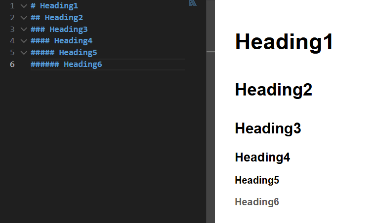
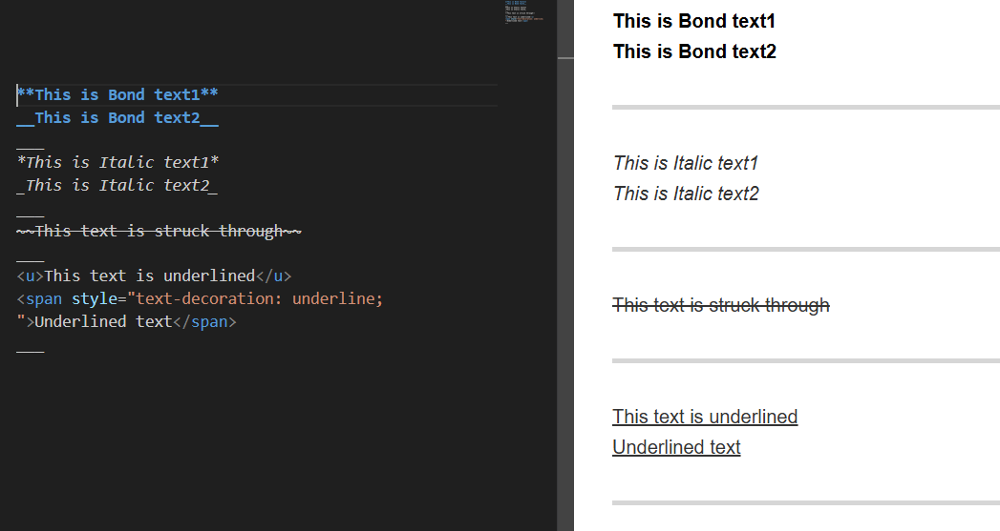
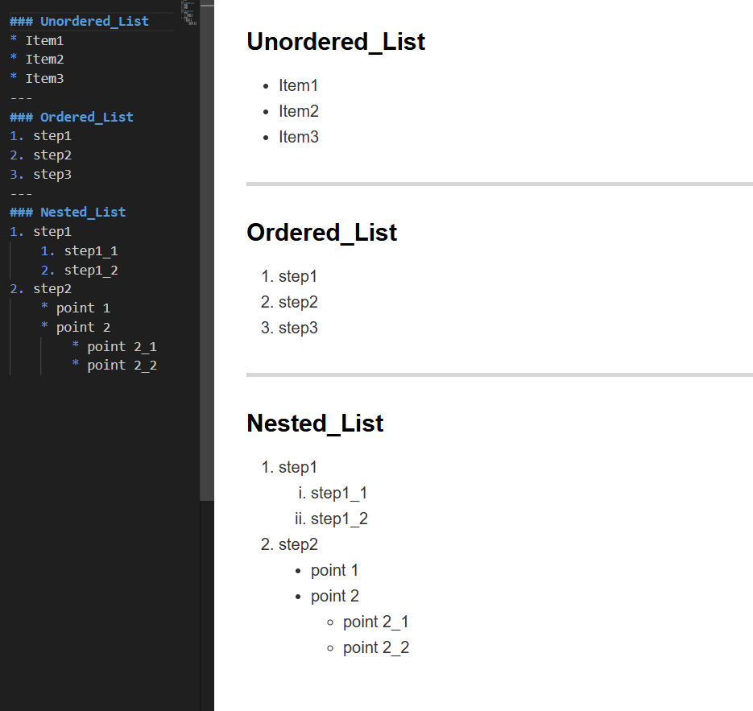

<!--
Note:-
All HTML Tags can be included
Such as <h1>,buttons,  and others.
-->

# Markdown Cheat Sheet: Basics
___
## Content:-
1. **[Introduction](#1-what-is-markdown)**
2. **[Heading](#2-heading)**
3. **[Text_Formatting](#3-text-formatting)**
4. **[Horizontal_Lines](#4-horizontal-lines)**
5. **[Lists](#5-lists)**
    1. **[Unorder_Lists](#unordered-lists)**
    2. **[Order_Lists](#ordered-lists)**
    3. **[Nested_Lists](#nested-lists)**
6. **[Links](#6-links)**
7. **[Photos](#7-photos)**
8. **[Blockquotes_and_Code]**
9. **[Tables]**
___
## 1. What is *Markdown*
 is a lighweight markup language that allows you to write using an easy-to-read, easy-to-write plain test format, which can then be converted to valid HTML.

**File extension** :-  `.md`

### Why use Markdown?
- **Simplicity:** No need to learn complex HTML tage
- **Compatibility:** Works on almost every platform (GitHub, Reddit)
- **Focus:** Allows you to focus on the Content rather that the design
___
## 2. Heading
 Heading are used to define the structure of your document, making it easier for the reader to navigate through the content.

 ### How to use them?
  You create headings by placing one or more `#` symbols at the beginning of a line.
  The number of `#` symbols determines the level of the heading:
  * #### H1 (Main Title)
    use one `#` symbol
  * #### H2 (Section)
    use two `##` symbols
  * #### H3 (Sub-Section)
    use three `###` symbols

    ### The difference between Headings:
    

 ### Important Rules:
 1. Always ensure there is a space between the **#** symbol and the text
 2. Heading levels range from `H1` to `H6`
 3. Heading levels define the logical structure of your content, not just the font size
___
## 3. Text Formatting
 Test formatting allows you to emphasize key points, organize information, and improve readability

 ### Emphasis and Styling
 * **Bold**: To make text stand out, wrap it with double asterisk `**` or  double underscore `__`

 * *Italic*: To add emphasis to a word wrap it with a single asterisk `*` or a single underscore `_`

 * ~~Strikethrough~~: To indicate a correction or removed text, wrap it with double tildes `~~`

 * <u>UnderLine</u>: to make an line under text. unfortunately, In Markdown, there is no standardized, universal syntax to create an underline like there is for bold or italics. For that, we can use HTML `<u> text </u>` or use css `Underlined text`

 ### Examples:
  
  ___
  ## 4. Horizontal Lines
  Horizontal rules are used to create a visual break between sections of your document, helping to separate different topics clearly.

  ### we can create it by:
  * using Dashes: `---`
  * using Asterisks: `***`
  * using Underscores: `___`

  ### Important rules:
  * ensure that the line containing the symbols is empty(has no other text)
  * number of symboles mustn't be less than 3  (three or more symbols)
  ___
## 5. Lists
  Lists are essential for organizing information. Markdown supports both unordered and ordered lists.

  * ### Unordered Lists
  Use these for items where the order does not matter

  #### we can create it by:
  * using an asterisk `*`
  * using a dash `-`
  * using a plus sign `+`

  * ### Ordered Lists
  use these for staps or sequences where order is important

  #### we can create it by:
  Start with a number followed by a period.

  * ### Nested Lists
  to create nested lists in markdown, the standard practice is to use 2 or 4 spaces for each level of indentation
  
  ### Example For Lists:
  

  ***Important Rules:***
  * make sure that there is a space between the symbols of Lists and the statement
  * For nested lists, make sure that every level of nested list made with No.tabs
  * It's said that using space bar is safer than using tab, `Tabs can sometimes cause rendering issues across different platforms (like GitHub vs. local viewers).`
___
## 6. Links
  Links are essential for connecting your documentation to external resources or navigating within the same document.

  ### Types of Links :-
  * #### External Links
    To link to a website, place the link text in brackets `[]` followed by the URL in parentheses `()`.
     
    * Syntax: `[google link](https://www.google.com)`
    * Result: [google link](https://www.google.com)
     
  * #### Internal Links (Anchor Links)
    You can link to a specific section within the same file
     
    **Note:-** Markdown generate an ID for every heading automatically (<u>lowercase, spaces replaced by dashes</u>).
     
    * Syntax: `[Go to Heading](#markdown-cheat-sheet-basics)`
    * Result: [Go to Heading](#markdown-cheat-sheet-basics)
     
  * #### Email Links
    You can create a direct link to an email addeess using the `mailto:` Protocol.

    ##### what is mailto: protocol?
      mailto: protocol is a Uniform Resource Identifier (URL) scheme used in HTML to create hyperlinks that automatically open a user's default email client when clicked.
       
    * Syntax: `<mo8729_11@outlook.com>`
    * Result: <mo8729_11@outlook.com>
     
    to change the viewed text
    * Syntax: `[my email](mailto:mo8729_11@outlook.com)`
    * Result: [my email](mailto:mo8729_11@outlook.com)
     
    **Important Rules:** 
    * No spaces: there must be no space between the bracket `[]` and the parenthesis `()`
    * Internal Links: Always ensure your internal anchor link matches your heading title exactly to avoid broken navigation
___
## 7. Photos
  Images are essential for making your documentation more visual and easier to understand.
  it's similar to links but with an Exclamation mark `!` at the beginning & putting the URL or path of photo.

  * Syntax: ``

  **Note:-** `[Alt text]`: a description of the image. this is important for accessibility (screen readers) and displays if the image fails to load.

  ***Important Rules:-***
  * No Spaces: just like links
  * Local paths: if your image is in a folder make sure the path is correct relative to your `.md` file.
  ___
